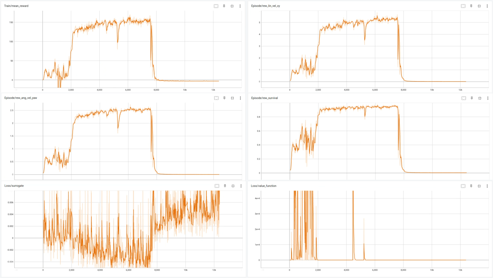
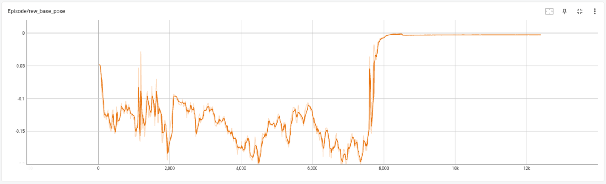
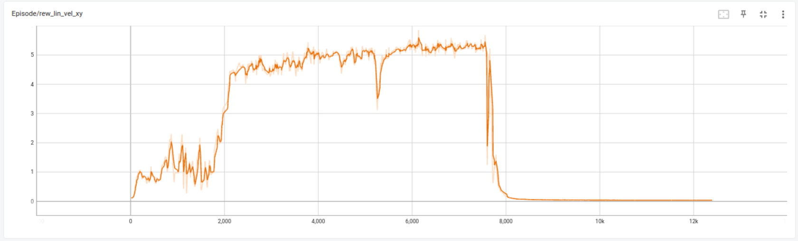
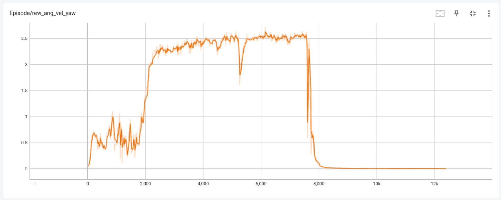
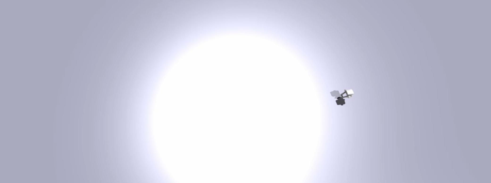
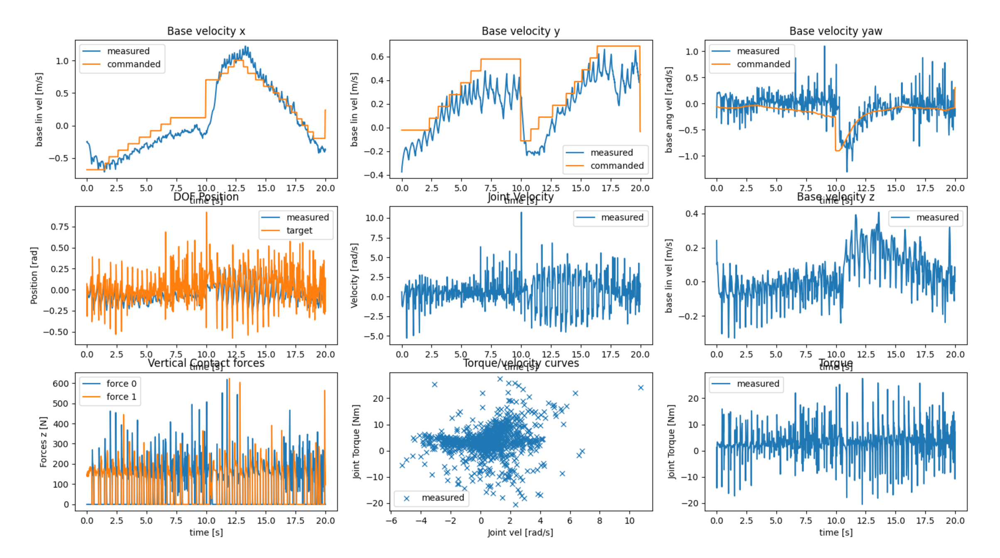
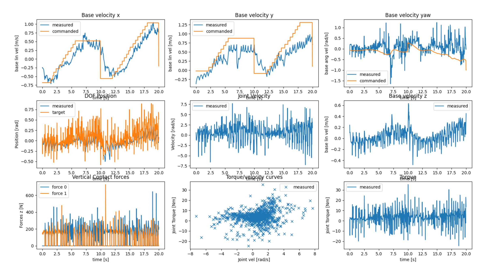
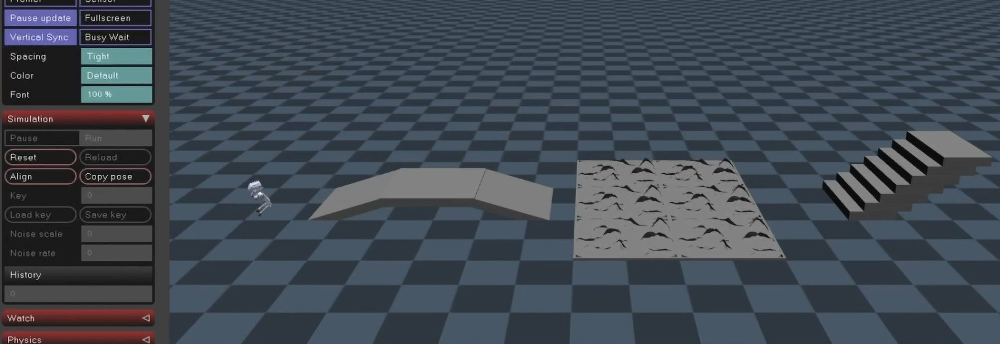
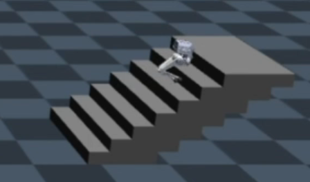

# SDM 5008 Final Project Report

> Square Zhong (钟吴子正)
>
> Younglar Han (韩鑫阳)
>
> Zhou Chen (陈骤)

> Github repo: [squarezhong/pointfootGym](https://github.com/squarezhong/pointfootGym)

## Scheme Description

In this project, we add more reward functions to achieve the smooth movement of the robot. We added the following functions.

- `_reward_ang_vel_yaw`

  Penalize yaw angular velocity to reduce unnecessary rotation.

- `_reward_lin_vel_xy`

  Penalize linear velocity in the xy plane to reduce unwanted translations in the xy plane.

- `_reward_lin_vel_z`

  Penalize linear velocity in z-axis to reduce unwanted translations in z-axis.

- `_reward_base_pose`

  Penalize base pose error to ensure the stability of body posture.

- `_reward_continuous_contact`

  The reward is given to prevent the robot from making too aggressive a movement, which is reminiscent of a racewalker always keeping one foot in contact with the ground.


> Since we accidentally discovered limxdynamics' repository, we directly referenced some of its parameters.

Accordingly, we added the scale of each reward. And we changed `base_height = -10.0`, `feet_air_time = 60`.

```python
ang_vel_yaw = 5.0
lin_vel_xy = 10.0
lin_vel_z = -0.5
base_pose = -5.0
continuous_contact = 1.0
```


During the training process, robots will be piled together after a certain number of episodes, which will cause the mutation of the reward function and make the training difficult to be continued. In this case, we reduced the number of training episodes to 20,000 to reduce pointless training.

The curves of main various functions in our training process are shown in the figure below. Finally, we select the `checkpoint=7000` result as our final policy.






<center>Fig.1 Train Process</center>

## Task a: Code Summary

We have attached a detailed documentation of the code. See in appendix.

## Task b: Flat Walking

### Speed Following Error

In the training process, considering the need to minimize the speed following error, we set `_reward_lin_vel_xy` and `_reward_ang_vel_yaw` to reward or punish the speed errors in the xy plane direction and the yaw direction to improve the performance of speed following. The training curves of the two reward functions are shown below. It can be seen that both rewards perform well when `checkpoint=7000`, so it can be considered that the probability of good speed following performance in simulation is high.



<center>Fig.2 Reward of linear velocity in xy plane</center>



<center>Fig.3 Reward of angular velocity of yaw</center>

### Base Pose Error

In the training process, considering the need to minimize the base pose error, we set `_reward_base_pose` to punish the base pose error, so as to improve the stability of base pose. The training curve of the reward function is shown below. It can be seen that the performance is well when `checkpoint=7000`, so it can be considered that the probability of good base pose error performance in the simulation is high.


<center>Fig.4 Reward of base pose</center>

### Flat Walking in Isaac Gym

Perform the test in Isaac Gym, and go to a terrain free area to achieve flat walking. The performance of the experiment is shown below. It can be seen from the figure that the robot performs well in the speed following of x axis, y axis and yaw axis. Video is attached. 

It can be started with the following command line. The operator can increase or decrease the speed in the x direction with the **W** or **S** keys, the y direction with the **A** or **D** keys, and the yaw direction with the **Q** or **E** keys, respectively. The test chart will be displayed in 20 seconds.

```shell
python legged_gym/scripts/play_task_b.py --task=pointfoot_rough
```



<center>Fig.5 Flat walking in Isaac gym</center>



<center>Fig.6 Flat walking performance</center>

## Task c: Anti-disturbance Capability

In order to improve the anti-disturbance ability of the robot, we apply random direction external force to push the robot during the training process, and set `_rew_dof_acc`, `_reward_lin_vel_z`, and `_reward_base_pose`. 

We repeat task b and add random external force to test the anti-disturbance ability of the robot by

```python
env_cfg.domain_rand.push_robots = True
```

The performance of the experiment is shown below. It can be seen from the figure that the robot performs well. Video is attached.

It can be started with the following command line. 

```shell
python legged_gym/scripts/play_task_c.py --task=pointfoot_rough
```



<center>Fig.7 Flat walking performance with disturbance</center>

## Task d: 

In this experiment, we use the Joystick to control the robot in Mujoco. And we test the robot on four kinds of terrain: flat ground, uphill and downhill slope, undulating road surface and stairs. At the same time, we carry out a high drop test on the robot. During the test, the robot does not lose its balance and fall down, showing excellent terrain adaptability. Video is attached.



<center>Fig.8 Terrain crossing test in Mujoco</center>

## Task f: Brilliant Action

We selected the following action as our highlights, when the robot is standing on the step overlooking the landscape below. The video is attached, and there is a surprise in the end.



<center>Fig.9 Brilliant action</center>

## Reference

- [limxdynamics/pointfoot-legged-gym](https://github.com/limxdynamics/pointfoot-legged-gym)

  Isaac Gym Environments for Legged Robots

- [SuDaxia-kai/pointfootGym](https://github.com/SuDaxia-kai/pointfootGym)

  This repository provides a starter-code for the Advanced Control for Robotics course's final project.